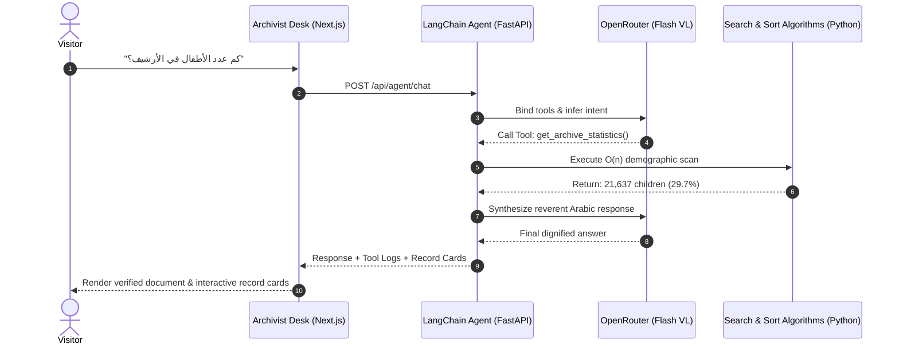

<div align="center">

# 🕊️ أسماء لا تُنسى — Palestinian Names Archive
### *From Numbers to Names · An Immersive WebGL & AI Living Memorial*

[](https://nextjs.org/)
[](https://react.dev/)
[](https://www.typescriptlang.org/)
[](https://fastapi.tiangolo.com/)
[](https://www.python.org/)
[](https://www.langchain.com/)
[](https://threejs.org/)
[](https://openrouter.ai/)

<br />

> **«النسيان هو الموت المشتهى، ولكن الذاكرة لا تموت.»**  
> *“Forgetfulness is the desired death, but memory never dies.”*  
> — **محمود درويش (Mahmoud Darwish)**

<br />

[📖 Narrative Flow](#-the-narrative-flow) •
[🤖 AI Archivist](#-ai-archivist-سجل-الذاكرة-الحية) •
[⚙️ Environment Setup](#-environment-variables--api-configuration) •
[🚀 Quick Start](#-quick-start) •
[🧮 Algorithms & Big-O](#-algorithms--data-structures) •
[🎨 Design System](#-design-system--aesthetics)

---

</div>

<br />

## 🌟 Overview

**أسماء لا تُنسى (Palestine Names Archive)** is an award-quality, scroll-driven interactive digital archive honoring **72,835+** documented Palestinian records. 

Departing from conventional dashboards and generic data tables, this project blends **WebGL human instanced mesh particles**, **classical editorial typography (Amiri & IBM Plex Sans Arabic)**, and an **algorithmic LangChain AI Archivist** to deliver a profound, reverent narrative experience:

```
                  THE SCROLL-DRIVEN JOURNEY
                  
  [ 00 · من أرقام إلى أسماء ]     Cold quantitative statistical count to human names
         │
         ▼
  [ 01 · خارطة الذاكرة الحية ]    72,000+ tiny human silhouettes rendered in WebGL
         │
         ▼
  [ 02 · سِجل الذاكرة والأسماء ]   Virtualized, searchable algorithmic ledger
         │
         ▼
  [ 03 · شجرة الأجيال والذاكرة ]  Living generation demographics & olive tree constellation
         │
         ▼
  [ 04 · سِجل الذاكرة الحيّة ]    Pure vector Archival Seal dossier & AI conversational desk
         │
         ▼
  [ 05 · ما يبقى ]               Darwish quote in flag colors, 3D «فلسطين» & Pro Colophon
```

---

## 🔑 Environment Variables & API Configuration

The AI Archivist utilizes **LangChain** with **OpenRouter** to run free or production LLMs connected directly to native Python search & sort algorithms.

### 1. Get an API Key
Obtain a free or paid API key from [OpenRouter](https://openrouter.ai/keys).

### 2. Configure the Backend `.env`
Create a `.env` file in the `backend/` directory (or copy `backend/.env.example`):

```bash
# In the backend directory
cp .env.example .env
```

Add your key to `backend/.env`:

```env
# ==============================================================================
# OpenRouter API Key for LangChain AI Archivist
# ==============================================================================
OPENROUTER_API_KEY=sk-or-v1-your-actual-api-key-here
```

### 3. Environment Variables Reference

| Variable | Required | Default / Fallback | Description |
|---|---|---|---|
| `OPENROUTER_API_KEY` | **Yes** | `""` | OpenRouter authentication token for LLM inference |
| `FREE_MODELS` | Optional | `inclusionai/ling-3.0-flash-vl:free` | Ordered model fallback pool if upstream limits occur |

> [!NOTE]
> All `.env` and secret credentials are automatically protected and ignored in version control via [`.gitignore`](.gitignore). A template is provided in [`.env.example`](.env.example) and [`backend/.env.example`](backend/.env.example).

---

## 🤖 AI Archivist (سِجل الذاكرة الحيّة)

The project features **«حارس الأرشيف» (The Archivist)** — an AI conversational agent built with **LangChain**, designed with strict ethical guidelines:
- 🚫 **Zero Hallucination Policy:** Never fabricates names, ages, or statistics.
- ⚡ **Algorithmic Execution:** Every inquiry executes real Python algorithms on the 72,835 dataset records.
- 🕊️ **Peace Dove Responder:** Lightweight GPU-accelerated animated peace dove carrying an olive branch during query resolution.
- 📜 **Dossier Folio with Vector Archival Seal:** Authentic editorial ledger styling featuring a handcrafted SVG national archival medallion (`ArchivalSeal`), eliminating raster image dependencies.



### Algorithmic Tools Bound to the Agent:
| Tool Name | Underlying Algorithm | Complexity | Purpose |
|---|---|---|---|
| `search_by_name` | Linear Scan | $O(n)$ | Substring search across Arabic & English names |
| `search_by_age` | Binary Search | $O(\log n)$ | Exact or tolerance search on sorted ages |
| `sort_by_age` | Quick Sort | $O(n \log n)$ | Partition-based age sorting (youngest / oldest) |
| `sort_by_name` | Merge Sort | $O(n \log n)$ | Stable alphabetical collation |
| `get_archive_statistics` | Aggregate Scan | $O(n)$ | Comprehensive demographic metrics & counts |

---

## 🧮 Algorithms & Data Structures

Every sorting and search operation across the **72,835 records** is implemented from algorithmic first principles in pure Python (no pandas):

```
┌─────────────────────────┬────────────────────────┬─────────────┬──────────────────────────────┐
│ Operation               │ Algorithm              │ Complexity  │ Characteristics              │
├─────────────────────────┼────────────────────────┼─────────────┼──────────────────────────────┤
│ Name Search             │ Linear Search          │ O(n)        │ Multi-token Arabic search    │
│ Age Search              │ Binary Search          │ O(log n)    │ Presorted index lookup       │
│ Age Sorting             │ Quick Sort             │ O(n log n)  │ In-place recursive partition │
│ Name Sorting            │ Merge Sort             │ O(n log n)  │ Stable divide-and-conquer    │
│ Chronological Sorting   │ Insertion Sort         │ O(n²)       │ Micro-batch demo sorting     │
└─────────────────────────┴────────────────────────┴─────────────┴──────────────────────────────┘
```

---

## 🚀 Quick Start

### Prerequisites
- [Node.js](https://nodejs.org/) (v18.17+ or v20+)
- [Python](https://www.python.org/) (v3.10+)

### One-Click Launch (Windows PowerShell)
```powershell
.\start.ps1
```

---

### Manual Setup

#### 1. Backend (FastAPI + LangChain)
```bash
cd backend

# Install dependencies
pip install -r requirements.txt

# Configure your OpenRouter API key
copy .env.example .env
# Edit .env and paste your OPENROUTER_API_KEY

# Run server
python -m uvicorn main:app --host 127.0.0.1 --port 8000 --reload
```
*API interactive documentation:* [`http://127.0.0.1:8000/docs`](http://127.0.0.1:8000/docs)

#### 2. Frontend (Next.js 16 App Router)
```bash
cd frontend

# Install dependencies
npm install

# Run local development server
npm run dev
```
*Experience the website:* [`http://localhost:3000`](http://localhost:3000)

---

## 🎨 Design System & Aesthetics

Crafted following **Awwwards** and **Magic UI** design standards:
- 📜 **Parchment & Editorial Warmth:** Cream ivory backgrounds (`#FAF8F5`, `#F7F5EE`), deep charcoal ink text (`#1C1A17`), and subdued olive green accents (`#436148`).
- 👥 **Human Particle WebGL Mesh:** Rather than generic circles or sparks, WebGL renders **72,000+ tiny 2D human silhouettes** with individual coordinates, breathing animations, and scroll-reactive dispersion.
- 🇵🇸 **Palestinian Flag Typography Climax:** Poetic memorial quote by Mahmoud Darwish rendered in Palestinian flag colors (olive green, carbon white, scarlet red) leading to the 3D calligraphy stage «فلسطين».
- 🏛️ **Pure Vector Archival Seal:** Handcrafted SVG medallion (`ArchivalSeal`) depicting the national archive olive wreath and historic foundation stamp without raster image bloat.
- 📖 **State-Adaptive Layout:** Smooth fluid transitions between visual hero scenes, virtualized record drawers, and the Archivist's dialogue desk.
- ♿ **Inclusive & Accessible:** RTL native layout with `dir="rtl"`, full keyboard navigation, text halos against 3D canvas scrims, and semantic HTML5 hierarchy.

---

## 📁 Repository Structure

```
palestine-names/
├── 📄 .env.example             # Root environment variables template
├── 📄 .gitignore               # Comprehensive Git ignore rules
├── 📄 killed-in-gaza.csv       # Primary dataset (72,835 records)
├── 📄 start.ps1                # Automated startup script
│
├── 📂 backend/                 # FastAPI & LangChain Application
│   ├── 📄 .env                 # (Ignored) Secrets & OpenRouter API key
│   ├── 📄 .env.example         # Backend environment template
│   ├── 📄 requirements.txt     # Python dependencies
│   ├── 📄 main.py              # FastAPI entry point & CORS
│   ├── 📂 algorithms/          # Search (Binary/Linear) & Sort (Merge/Quick)
│   ├── 📂 data/                # In-memory CSV dataset loader
│   └── 📂 routers/
│       ├── records.py          # REST endpoints (72k records, stats, pagination)
│       └── agent.py            # LangChain AI Archivist & Tool Calling
│
└── 📂 frontend/                # Next.js 16 Interactive Memorial
    ├── 📂 public/              # Assets & Favicons
    └── 📂 src/
        ├── 📂 app/             # App Router layout, metadata, styles
        ├── 📂 components/
        │   ├── 📂 narrative/   # Opening, Living Crowd, Archive, Folio Desk, Finale, ArchivalSeal
        │   ├── 📂 particles/   # Three.js WebGL Instanced Human Silhouette Mesh
        │   └── 📂 archive/     # Record modal & verification dialogs
        └── 📂 lib/             # API client, particle state store, types
```

---

## 📜 Dataset Citation & Credits

- Records compiled from verified official registry records from Gaza, Palestine.
- Total recorded individuals in this release: **72,835**.

---

<div align="center">

**«الرقم يُحصى، لكن الاسم يُتذكّر.»**  
*A number is counted, but a name is remembered.*

Made with dignity and reverence by **[Mohammed Babaqi](https://github.com/MohammedBabaqi)**

</div>
